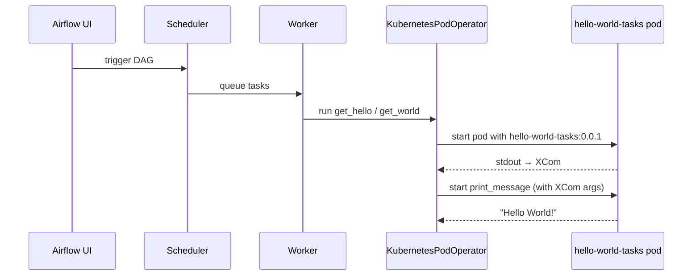

# Airflow on Kubernetes (local)

Requires **Docker Desktop Kubernetes**. Task images are built on the host and read from the Docker Desktop image store — no separate registry container.

## First-time setup

```bash
# 0. Generator deps (once, on your machine)
# Debian/Ubuntu blocks system-wide pip (PEP 668); use a venv:
sudo apt install python3-venv   # once, if `python3 -m venv` fails
python3 -m venv .venv
.venv/bin/pip install -r dags/scripts/requirements.txt

# 1. Build the Airflow platform image
./config/build-image.sh

# 2. Install Airflow via Helm
./config/deploy-platform.sh

# 3. Build task image (first release → 0.0.1), then publish DAGs
./dags/push-task-image.sh patch --publish
```

## Image versioning

Task image tags are **not stored in the repo**. Docker Desktop's image store is the source of truth (`docker images hello-world-tasks`).

```bash
./dags/push-task-image.sh patch              # 0.0.1 → 0.0.2
./dags/push-task-image.sh minor              # 0.0.2 → 0.1.0
./dags/push-task-image.sh major              # 0.1.0 → 1.0.0
./dags/push-task-image.sh patch --publish    # build and publish DAGs in one step
```

Publish an existing tag without rebuilding:

```bash
./dags/scripts/publish-dags.sh --tag 0.0.1
```
## Runtime



## Redeploy task code

```bash
# 1. Edit dags/tasks/task_*.py or dags/lib/*.py

# 2. Bump semver, build image, publish DAGs
./dags/push-task-image.sh patch --publish
```

## Task layout

- `dags/lib/` — shared task logic
- `dags/tasks/task_<name>.py` — one file per task, loaded lazily by `entrypoint.py`
- `dags/entrypoint.py` — `python entrypoint.py <task_name> [args...]` in KubernetesPodOperator
- `dags/scripts/test_task_imports.py` — checks that loading one task does not run the others

```bash
python3 dags/scripts/test_task_imports.py
```

## DAG authoring

- Edit YAML in `dags/definitions/*.yaml`
- `dags/scripts/publish-dags.sh --tag <semver>` generates DAG Python in a temp dir at deploy time and copies it to `/opt/airflow/dags/` on the dag-processor pod
- The image tag is passed at publish time — it is not committed to the repo
