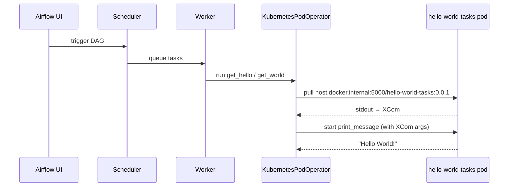

# Airflow on Kubernetes (local)

## First-time setup

```bash
# 0. Generator deps (once, on your machine)
# Debian/Ubuntu blocks system-wide pip (PEP 668); use a venv:
sudo apt install python3-venv   # once, if `python3 -m venv` fails
python3 -m venv .venv
.venv/bin/pip install -r dags/scripts/requirements.txt

# 1. Start local Docker registry
./config/start-registry.sh

# 2. Allow the cluster to pull from the local registry (Docker Desktop)
#    Settings → Docker Engine → add to "insecure-registries":
#    "host.docker.internal:5000", "localhost:5000"

# 3. Build the Airflow platform image
./config/build-image.sh

# 4. Install Airflow via Helm
./config/deploy-platform.sh

# 5. Build + push task image (first release → 0.0.1), then publish DAGs
./dags/load-image.sh patch --publish
```

## Image versioning

Task image tags are **not stored in the repo**. The local registry is the source of truth.

```bash
./dags/load-image.sh patch              # 0.0.1 → 0.0.2
./dags/load-image.sh minor              # 0.0.2 → 0.1.0
./dags/load-image.sh major              # 0.1.0 → 1.0.0
./dags/load-image.sh patch --publish    # build, push, and publish DAGs in one step
```

Publish an existing tag without rebuilding:

```bash
./dags/scripts/publish-dags.sh --tag 0.0.1
```

Environment overrides:

| Variable | Default | Purpose |
|---|---|---|
| `REGISTRY` | `localhost:5000` | Where `docker push` goes |
| `K8S_REGISTRY` | `host.docker.internal:5000` | Image host Kubernetes pulls from |
| `IMAGE_NAME` | `hello-world-tasks` | Repository name |

## Runtime



## Redeploy task code

```bash
# 1. Edit dags/tasks/*.py

# 2. Bump semver, push to registry, publish DAGs
./dags/load-image.sh patch --publish
```

## DAG authoring

- Edit YAML in `dags/dags/definitions/*.yaml`
- `dags/scripts/publish-dags.sh --tag <semver>` renders `dags/dags/templates/dag.py.j2` into `dags/dags/generated/*.py`, then copies those files to `/opt/airflow/dags/` on the dag-processor pod
- The image tag is passed at publish time — it is not committed to the repo
