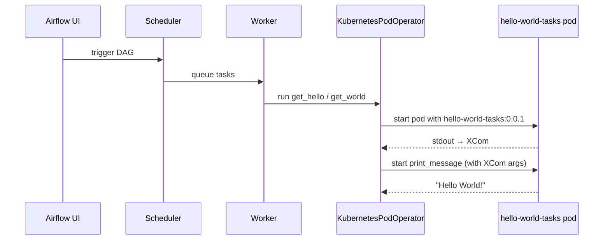

# Airflow on Kubernetes (local)

Requires **Docker Desktop Kubernetes**. Task images are built on the host and read from the Docker Desktop image store — no separate registry container.

## First-time setup

```bash
# 0. Optional venv for bump_semver (once, on your machine)
# Debian/Ubuntu blocks system-wide pip (PEP 668); use a venv:
sudo apt install python3-venv   # once, if `python3 -m venv` fails
python3 -m venv .venv

# 1. Build the Airflow platform image
./config/build-image.sh

# 2. Install Airflow via Helm
./config/deploy-platform.sh

# 3. Build converter and task images, then publish DAGs
./converter/push-converter-image.sh
./dags/push-task-image.sh patch --publish
```

## Image versioning

Task and converter image tags are **not stored in the repo**. Docker Desktop's image store is the source of truth.

```bash
./dags/push-task-image.sh patch              # hello-world-tasks 0.0.1 → 0.0.2
./dags/push-task-image.sh minor              # 0.0.2 → 0.1.0
./dags/push-task-image.sh major              # 0.1.0 → 1.0.0
./dags/push-task-image.sh patch --publish    # build task image and publish DAGs

./converter/push-converter-image.sh          # hello-world-converter:latest
./converter/push-converter-image.sh patch    # semver bump when template/generator changes
```

Publish DAGs for an existing task image tag:

```bash
./converter/publish.sh --codebase-tag 0.0.1
```

## Runtime



## Redeploy task code

```bash
# 1. Edit dags/tasks/task_*.py or dags/lib/*.py

# 2. Bump semver, build image, publish DAGs
./dags/push-task-image.sh patch --publish
```

## Task layout

- `dags/lib/` — shared task logic
- `dags/tasks/task_<name>.py` — one file per task, loaded lazily by `entrypoint.py`
- `dags/entrypoint.py` — `python entrypoint.py <task_name> [args...]` in KubernetesPodOperator

## Converter layout

- `converter/` — Docker image that turns YAML into Airflow DAG Python and publishes to the cluster
- `dags/definitions/*.yaml` — DAG definitions (mounted into the converter at publish time)
- `converter/templates/dag.py.j2` — Jinja template baked into the converter image

```bash
./converter/publish.sh --codebase-tag 0.0.1
```

## DAG authoring

- Edit YAML in `dags/definitions/*.yaml`
- Rebuild the converter image when `generate_dags.py` or the template changes
- `./converter/publish.sh --codebase-tag <semver>` generates DAG Python and copies it to `/opt/airflow/dags/` on the dag-processor pod
- The codebase image tag is passed at publish time — it is not committed to the repo
